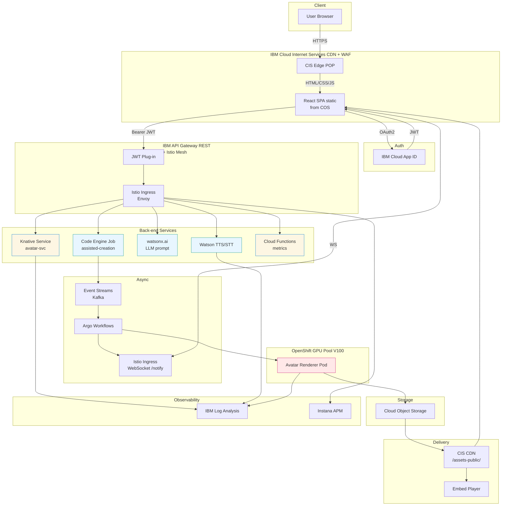

# 🎬 WatsonX VideoGenie

> Turn plain text into AI‑generated avatar videos using IBM Cloud managed services, Watson x foundation models and OpenShift GPU compute. This repository contains **everything** required to deploy the stack end‑to‑end.

[]()
[]()
[]()
[](https://github.com/ruslanmv/watsonx-videogenie/actions/workflows/local-smoke.yml)

A **proof‑of‑concept** that converts any script into a narrated avatar video using IBM Cloud buckets, serverless & GPU nodes.

---

## What’s inside?

A single repo that stands up **every layer** of the diagram below: CIS edge, App ID auth, API Gateway, Istio mesh, Knative micro‑services, Event Streams (Kafka), Argo Workflows, GPU render pods, COS video delivery, Log Analysis and Instana tracing.  The React SPA calls these APIs and delivers an MP4 in roughly a minute.


---

---

## ⚡ Quick start (local ≤ 10 min)

It mirrors the streamlined workflow we refined earlier and runs **entirely on your laptop** with Kind.

```bash
# 0 · Prereqs: Docker + Kind + Make + Node 18 + Python 3.11 on your host
# ────────────────────────────────────────────────────────────────────

# 1 · Clone the repo
git clone https://github.com/ruslanmv/watsonx-videogenie.git
cd watsonx-videogenie

# 2 · Build local OCI images
make container-build TAG=$(git rev-parse --short HEAD)

# 3 · Create Python toolchain (optional helper scripts)
make setup
# source .venv/bin/activate   # if you want to run Python utilities

# 4 · Spin a Kind cluster named “videogenie”
make kind-up                 #  ➜  k8s + Istio + Knative + Argo + KEDA

# 5 · Deploy the stack into Kind
make install-istio install-argo install-keda
helm upgrade --install videogenie charts/videogenie \
  --namespace videogenie --create-namespace \
  --set global.image.tag=$(git rev-parse --short HEAD)

# 6 · Run the front‑end dev server (auto‑reload)
cd frontend
npm ci
npm start                     # ⇢ http://localhost:5173

echo
echo "✅  Local VideoGenie is ready."
echo "🖼  Test avatar list:   curl -s http://localhost:8000/avatars"
echo "🌐  SPA dev server:    http://localhost:5173"
```

The commands above **do not touch IBM Cloud**—they just prove the stack works end‑to‑end on your machine.

For a **production IBM Cloud** deployment follow the step‑by‑step sections below.

---

## 1 · Prerequisites

* IBM Cloud account with resource‑group `videogenie` and VPC enabled.
* OpenShift 4.15 cluster with at least one **V100 or L40S** worker pool (`role=gpu=true`).
* CLIs: `ibmcloud` + plugins `container‑registry`, `kubernetes‑service`, `cis`, `resource‑group`, `app‑id`, `fn`, `secrets‑manager`.
* Local tooling: `oc`, `helm`, `terraform`, `make`.

---

## 2 · Provision cloud foundation (Terraform)

```bash
cd infra/terraform
terraform init
terraform apply -auto-approve -var domain="videogenie.cloud" -var region="eu-de"
# Outputs show bucket names, App ID ids, Kafka brokers…
cd ../..
```

---

## 3 · Build & push images

```bash
ibmcloud cr region-set eu-de && ibmcloud cr login
export TAG=$(git rev-parse --short HEAD)
make build-all tag=$TAG && make push-all tag=$TAG
```

---

## 4 · Deploy to OpenShift

```bash
# Cluster credentials
ibmcloud ks cluster config --cluster vg-cluster

# GPU node labels / taints (skip if your pool is pre‑labelled)
oc label nodes -l kubernetes.io/hostname=<gpu-node> role=gpu=true
oc adm taint nodes -l role=gpu=true dedicated=gpu:NoSchedule

# Add‑ons (Istio mesh, Argo WF/Events, KEDA autoscaler)
make install-istio install-argo install-keda

# Helm release
helm upgrade --install videogenie charts/videogenie \
  --namespace videogenie --create-namespace \
  --set global.image.tag=$TAG \
  --set spa.bucket=$(terraform -chdir=infra/terraform output -raw spa_bucket)
```

KEDA scales `renderer-deployment` 0→N as Kafka lag grows.

---

## 5 · CI/CD

GitHub Actions → builds images → pushes to ICR → triggers Tekton pipeline → Helm upgrade via Argo CD.  The pipeline purges CIS cache so the new SPA is live within seconds.

---

## 6 · Smoke test

Open `https://app.videogenie.cloud`, sign in, paste a script, click **Generate**.  WebSocket frames stream progress; final message contains a signed COS URL — open it to view the rendered MP4.

---

## 7 · Repo tree (top‑level)

```text
frontend/      – React SPA & Tailwind UI
services/      – Knative + Code Engine sources
renderer/      – CUDA GPU worker
charts/        – Helm umbrella chart
infra/         – Terraform edge/auth/infra
pipelines/     – Argo WF + Tekton CI
manifests/     – KEDA, Istio VS, WebSocket YAML
.github/       – CI workflows
README.md      – this file
```

---

## 8 · Clean‑up

```bash
helm uninstall videogenie -n videogenie
make kind-down   # if you spun kind
terraform -chdir=infra/terraform destroy -auto-approve
ibmcloud cis instance-delete $(cis zone ls | awk '/videogenie/{print $1}') -f
```

---

## 9 · Roadmap

* Diffusion‑based head motion (AnimateDiff).
* Live WebRTC preview via media‑relay ingress.
* Avatar marketplace for user‑supplied models.

---

## License

Apache 2.0 — build, remix, share.  If you create something cool, PRs are welcome!

Enjoy building! PRs & issues welcome. For support jump into #videogenie on the IBM Cloud community Slack.
