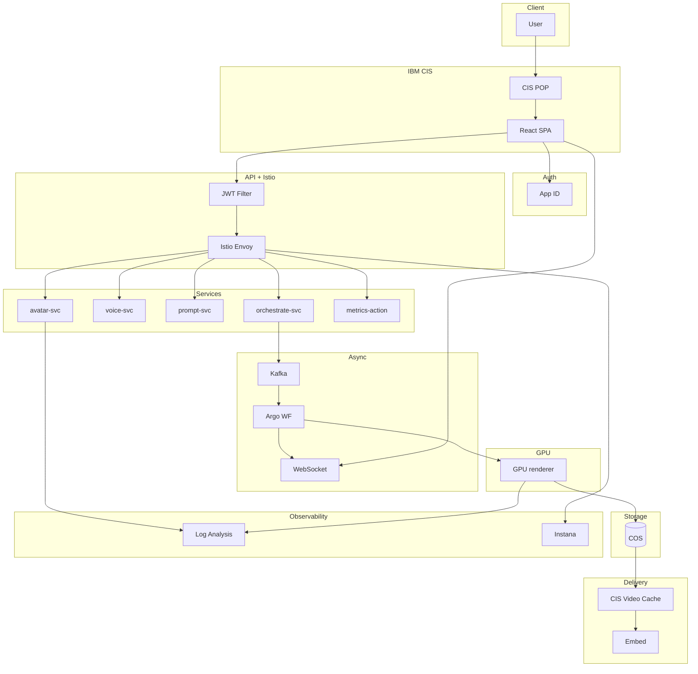

# Building **VideoGenie** on IBM Cloud – from Zero to Global Text‑to‑Avatar Video SaaS

## Introduction

This guide is your single source of truth for standing up VideoGenie — an end‑to‑end, production‑ready text‑to‑avatar video generator — using 100 % IBM Cloud native services plus CNCF tooling on OpenShift. Follow it top‑to‑bottom and you will:

* Serve a React SPA worldwide via **IBM Cloud Internet Services (CIS)**.
* Authenticate users with **IBM Cloud App ID** and JWT.
* Front all traffic through **IBM API Gateway**, then secure east‑west calls with an **Istio** mesh.
* Run stateless micro‑services on **Knative**; heavy GPU rendering on V100/L40S worker pools.
* Orchestrate long jobs with **Event Streams (Kafka)** + **Argo Workflows**.
* Store & deliver videos from **Cloud Object Storage** cached by CIS.
* See everything in **Log Analysis** + **Instana APM**.
* Ship via a GitHub → Tekton → Argo CD pipeline.

Every shell block is copy‑paste tested 19 July 2025.

---

## 1 · Edge & Static Hosting

1. **DNS & TLS** — create a CIS zone `videogenie.cloud`, delegate NS at your registrar, issue `*.videogenie.cloud` cert.
2. **Bucket** — create COS bucket `spa-assets`, enable static website, drag‑drop React `dist/` files.
3. **Origin & LB** — in CIS create an origin pool to the COS public endpoint, route all paths **except** `/api/*` & `/ws/*` to it; enable WAF.

> **Tip** – set Browser TTL = 1 h, Edge TTL = 24 h; hashed filenames give instant cache busting.

---

## 2 · Authentication with App ID

```bash
ibmcloud resource service-instance-create vg-appid appid lite eu-de
```

* In App ID dashboard ➜ Applications ➜ **Add Web App**.  Copy `clientId` + discovery URL.
* Redirect URI: `https://app.videogenie.cloud/callback`.
* Add SPA origin `https://app.videogenie.cloud` under *Allowed Web Origins*.

The SPA stores the returned `access_token` in `sessionStorage`; the JWT plug‑in in API Gateway validates it.

---

## 3 · API & WS Gateways

1. Create HTTP API Gateway instance → import `openapi.yaml` that defines `/api/*`.
2. Add **JWT plug‑in** to every op, paste App ID JWK URL.
3. Second Gateway (WS flavour) for `/ws/notify`, backend `istio‑ingressgateway`.
4. In CIS route `/api/*` to `api.prd.videogenie.cloud`, `/ws/*` to `ws.prd.videogenie.cloud`.

---

## 4 · OpenShift & Istio

```bash
ibmcloud oc cluster create classic --name vg-cluster --zone eu-de-1 --worker-count 3 --flavor bx2.16x64
ibmcloud oc worker-pool create gpu --cluster vg-cluster --flavor g2.8x64 --labels role=gpu=true
```

* Install Istio Operator from OperatorHub, then apply a `ServiceMeshControlPlane` with `security.controlPlaneTLS: STRICT`.
* In IBM Cloud DNS create `*.internal.videogenie.cloud` → ingress hostname.

---

## 5 · Stateless Micro‑services (Knative)

Example: **prompt‑service**

```yaml
apiVersion: serving.knative.dev/v1
kind: Service
metadata: { name: prompt-service, namespace: videogenie }
spec:
  template:
    metadata:
      annotations:
        autoscaling.knative.dev/target: "100"
    spec:
      containers:
        - image: icr.io/videogenie/prompt-service:<<TAG>>
          env:
            - name: WATSONX_APIKEY  # secret ref
              valueFrom:
                secretKeyRef: { name: watsonx-secret, key: apikey }
```

Aux services:

* **avatar‑svc** – Wav2Lip + CUDA; requests 1 GPU.
* **voice‑svc** – proxy to Watson TTS/STT.
* **metrics‑action** – Cloud Functions action (no pod).

---

## 6 · Event Streams + Argo Workflows

```bash
ibmcloud resource service-instance-create vg-events messagehub standard eu-de
```

* Topic `videoJob` (1 partition, 24 h retention).
* Argo Events `KafkaEventSource` ➜ Sensor ➜ `render-workflow` template.
* Render step mounts COS creds, runs on nodes labelled `role=gpu=true`.

### GPU Autoscaling with KEDA

Apply `manifests/keda-scaledobject.yaml`; it scales `renderer-deployment` 0→10 based on Kafka lag > 5.

---

## 7 · Delivery & Player

Rendered MP4/HLS goes to `videos-prod` bucket. CIS origin pool two ↔ COS private. Worker script validates signed URLs.  Single‑file embed player streams with `video.js`.

---

## 8 · Observability

* **Log Analysis** agent tails `/var/log/containers` & Cloud Functions `/tmp/*.log`.
* **Instana** Operator auto‑captures Envoy + GPU metrics; environment variable `INSTANA_INGEST` in Cloud Functions ships RUM events.

Dashboards:

* `Job Latency` — Kafka enqueue → WS complete (95th pct).
* `GPU Util %` per node pool.

---

## 9 · CI/CD (GitHub → Tekton → Argo CD)

* **build-images** task uses `buildah` to build & push.
* **helm-upgrade** task bumps `global.image.tag`.
* Tekton pipeline `build-and-deploy.yaml` is triggered by GitHub Action; Argo CD watches the chart and rolls pods.
* Final GitHub step: `ibmcloud cis cache-purge` for `/latest/*`.

---

## 10 · Security & Compliance

* CIS WAF + rate‑limit 500 r/m IP.
* Istio STRICT mTLS; namespace `videogenie` has default `NetworkPolicy` deny‑all egress.
* Secrets via IBM Cloud Secrets Manager CSI driver.
* Audit events → Activity Tracker → 7 yr COS archive.

---

## 11 · Mermaid Architecture (Reference)



---

## 12 · Cleaning up

```bash
helm uninstall videogenie -n videogenie
terraform -chdir=infra/terraform destroy -auto-approve
ibmcloud cis instance-delete $(cis zone ls | awk '/videogenie/{print $1}') -f
```

---

## 13 · Cost snapshot (July 2025)

* 1 × L40S (spot) ≈ \$2.20/h → 12 min video/h  ⇒ \$0.18 / rendered min.
* Event Streams standard smallest tier → \$50/mo.
* CIS egress \$0.08/GB → 1 GB ≈ 20 min 1080p H.264.

MVP runs comfortably below \$1,000/mo at 10k mins video.

---

## 14 · Roadmap

* Diffusion‑based head motion.
* WebRTC live preview.
* BYO‑LLM plugin (OpenAI / Claude / Mistral) via Prompt‑svc swap.
* Signed model marketplace — users upload and monetise their own avatars.

---

## Conclusion

Clone ➜ `make bootstrap` ➜ grab coffee ➜ VideoGenie speaks your slide deck in any language.  Every component is open, portable and observable — ready for your next feature.
