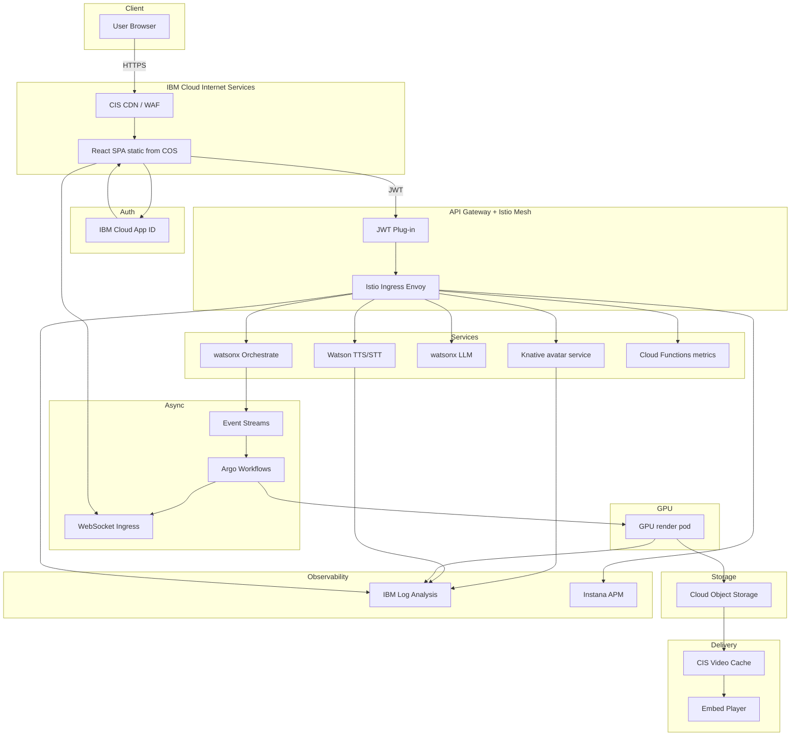

# Building VideoGenie on IBM Cloud – from Zero to Global Text‑to‑Avatar Video SaaS

## Introduction

This tutorial walks through every decision, command and line of code required to stand up the complete VideoGenie platform on IBM Cloud.  By the time you reach the final section you will have a working React front‑end served from IBM Cloud Internet Services, a JWT‑protected API front door, an Istio‑secured service mesh running on Red Hat OpenShift, Watson‑powered speech and language services, an asynchronous Kafka‑Argo pipeline that orchestrates GPU rendering, a Cloud Object Storage delivery tier accelerated by the CIS edge, and full observability with Log Analysis and Instana.  The narrative assumes you start with nothing but an IBM Cloud account, the `ibmcloud` CLI, access to an OpenShift cluster with V100 nodes and a GitHub repository for the code.

## Establishing the edge and static hosting layer

You begin by creating a CIS managed DNS zone for `videogenie.cloud`.  After delegating your registrar’s name‑servers to the ones supplied by CIS you request a wildcard certificate.  The certificate request happens in the CIS dashboard where you choose Let’s Encrypt as the issuer and add `*.videogenie.cloud`, then click issue.  CIS prompts you to create a challenge record; once the certificate is issued it automatically appears inside the TLS section with status active.  You now create a Cloud Object Storage bucket called `spa-assets` and enable static website hosting through the COS UI by supplying `index.html` as the index document.  A React production build placed in that bucket with hashed filenames is instantly reachable at the public COS endpoint, but you still need to hide the COS URL behind the edge.  In the CIS portal you add an Origin Pool pointing to the COS endpoint, then create a Load Balancer configuration that routes any path except `/api` and `/ws` to that pool.  The final step is a Page Rule in CIS that sets cache TTL to one day and turns on HTTP to HTTPS redirection so every request arrives encrypted.

## Setting up authentication with App ID

In the IBM Cloud console you create an App ID instance and choose Cloud Directory as the identity source.  In the App ID settings you add your frontend origin to the list of allowed web origins then create an application of type web.  You copy the `clientId` and the `oauthServerUrl` because the React application needs them to initiate the OAuth 2 Authorisation Code flow with PKCE.  Inside the OAuth section you register `https://app.videogenie.cloud/callback` as the redirect URI.  The hosted login page requires no further styling to work, although you can upload a custom logo in the dashboard later.  At this point logging into App ID returns an `access_token` that the SPA stores in `sessionStorage`.  The token is a JWT whose issuer corresponds to the tenant’s App ID OIDC discovery document.

## Creating the REST and WebSocket gateways

You deploy IBM API Gateway through the console, choosing the subtype HTTP API because it supports low latency and JWT plug‑ins.  An OpenAPI document defines every endpoint: `/api/avatars`, `/api/voices`, `/api/prompt`, `/api/assist` and `/api/metrics`.  For each operation you attach the JWT plug‑in, paste the JWK URL from App ID discovery, and require the default `openid` scope.  WebSockets are handled in a separate gateway instance configured for the path `/ws/notify` that points at an Istio Ingress Service.  The API Gateway domain is mapped in CIS by creating a new DNS record `api.prd.videogenie.cloud` that resolves to the gateway’s public hostname.  CIS routing rules forward `/api/*` to that record and `/ws/*` to the WebSocket gateway record.

## Installing OpenShift and Istio

You provision a Red Hat OpenShift on IBM Cloud cluster with at least three worker nodes in the `bx2.16x64` flavour and a separate node pool tagged `gpu=true` that uses the V100 VSI flavour.  After the cluster is ready you install the Istio Operator from the OpenShift Operator Hub, accept the defaults and then create a `ServiceMeshControlPlane` custom resource in the `istio-system` namespace that enables strict mTLS.  The Istio ingress gateway is exposed as `istio-ingressgateway-istio-system.<cluster-domain>`.  In IBM Cloud DNS you add a wildcard CNAME `*.internal.videogenie.cloud` that points to this hostname so every mesh service can be reached via a deterministic URL.

## Deploying the stateless microservices

All microservices are built as OCI images with multi‑stage Dockerfiles and pushed to IBM Cloud Container Registry under the namespace `icr.io/videogenie`.  For example the avatar service Dockerfile starts from `quay.io/quarkus/quarkus-micro-image:2.5` and copies a GraalVM compiled binary.  You create a Knative Service with the following manifest:

```yaml
apiVersion: serving.knative.dev/v1
kind: Service
metadata:
  name: avatar-service
spec:
  template:
    metadata:
      annotations:
        autoscaling.knative.dev/target: "80"
        autoscaling.knative.dev/minScale: "0"
        autoscaling.knative.dev/maxScale: "10"
    spec:
      containers:
        - image: icr.io/videogenie/avatar-service:main
          env:
            - name: DATABASE_URL
              value: $(DATABASE_URL)
```

The environment variable expansion comes from a ConfigMap that points to a small Cloudant instance although you could swap this for a PostgreSQL service.  Watson Speech to Text and Text to Speech require no deployment; you only create a resource key in their respective IBM Cloud services and inject the key into the voice service via Kubernetes secret.

The prompt service is a thin Python Flask wrapper around watsonx.ai foundation models.  Its Knative manifest is similar except that it uses the official watsonx SDK and authenticates with a bearer token from Secrets Manager.

The metrics service is a single OpenWhisk action written in TypeScript that ingests JSON payloads and forwards them to Instana using the agent’s `/metric` endpoint.  You deploy it with the CLI:

```bash
ibmcloud fn action create vg-metrics dist/bundle.js --kind nodejs:18 --web true
```

## Wiring the asynchronous pipeline with Kafka and Argo Workflows

In the IBM Cloud console you create an Event Streams instance called `vg-events`.  Inside it you add a topic `videoJob` with one partition and a retention of twenty‑four hours.  The orchestrate service produces messages to that topic once it has gathered the full job specification.  Each message is a compact Avro record containing the job identifier, the user identifier, the requested avatar id, the chosen voice id and the normalised script.  In the OpenShift cluster you install Argo Workflows via its Helm chart.  Then you install the Argo Events controller and configure a `KafkaEventSource` that connects with the SASL credentials from Event Streams.  The sensor triggers a workflow template that mounts the COS credentials and spawns a render pod on GPU nodes using a simple affinity rule.

```yaml
apiVersion: argoproj.io/v1alpha1
kind: Workflow
metadata:
  generateName: render-
spec:
  entrypoint: main
  templates:
    - name: main
      steps:
        - - name: render
            template: render-step
            arguments:
              parameters:
                - name: payload
                  value: '{{workflow.parameters.kafka-message}}'
    - name: render-step
      inputs:
        parameters:
          - name: payload
      container:
        image: icr.io/videogenie/renderer:2025-07-18
        resources:
          limits:
            nvidia.com/gpu: 1
```

The render container pulls the avatar model weights from COS at start‑up, converts the TTS audio to viseme timing, runs Wav2Lip for lip‑sync, encodes with FFmpeg NVENC and uploads the resulting MP4 back to the COS bucket `videos-prod`.  After upload it uses the COS SDK to generate a pre‑authenticated URL valid for two hours and publishes an update to a second Kafka topic `videoStatus`.  A lightweight Go service behind the Istio WebSocket ingress fans those updates out to connected browsers so the user sees a real‑time progress bar.

## Configuring GPU autoscaling

OpenShift installs the NVIDIA GPU operator automatically when it detects GPU nodes.  You label each GPU node with `role=gpu` and taint it with `dedicated=gpu:NoSchedule`.  The render deployment has a toleration for that taint so non‑GPU workloads never land on those nodes.  You then deploy KEDA along with the cluster‑autoscaler.  KEDA defines a `ScaledObject` that watches the lag on the `videoJob` Kafka topic and increases the replica count of the render deployment.  The cluster‑autoscaler notices unschedulable GPU pods and provisions additional V100 VSI workers up to the quota limit.  A second KEDA scaledown rule takes the replica count back to zero after five minutes of inactivity and the cluster‑autoscaler subsequently drains idle GPU nodes.

## Delivering video through CIS

The COS bucket uses private access, so every request must carry a pre‑authenticated query string.  IBM Cloud Internet Services can still cache the object because the signed portion is ignored when generating the cache key.  You create a second origin pool in CIS that points at the COS private endpoint and configure a cache rule `/assets-public/*` with an edge TTL of thirty days and an origin TTL of one year.  A worker script validates the signature expiration to avoid serving stale links.  The embed player is a static HTML page stored in the same bucket; it pulls the MP4 or HLS playlist from the signed URL and plays it in a `video` tag with controls hidden for a clean look.

## Observability set‑up

Log forwarding is enabled by installing the Log Analysis agent in the OpenShift cluster.  The agent is configured to tail container logs from `/var/log/containers` and send them to the LogDNA ingestion endpoint.  Instana is installed via the Operator in the `instana-agent` namespace.  Instana automatically hooks into Envoy sidecars in the mesh, traces every incoming request and displays a service dependency graph that highlights latency spikes.  The Sysdig monitoring agent collects node exporter metrics, GPU utilisation and custom Prometheus metrics exposed by the render container at `/metrics`.

## Continuous delivery pipeline

Your GitHub repository contains a `Dockerfile`, a Helm chart and a set of Kubernetes manifests.  A GitHub Actions workflow triggers on push to `main`; it builds the avatar service image, the render image and any other components, pushes them to ICR, then invokes `ibmcloud oc cluster config` and uses `helm upgrade` through `kubectl` to apply changes.  The workflow also calls the CIS API to purge the CDN cache for `/latest/*` paths so new player builds propagate instantly.

## Final mermaid reference



## Security and compliance wrap‑up

Every public endpoint sits behind CIS WAF and API Gateway rate controls while Istio applies mutual TLS for pod‑to‑pod hops, App ID short‑lived JWTs expire in one hour and render nodes assume no persistent credentials.  Secrets land in IBM Cloud Secrets Manager and mount into the mesh via CSI drivers so nothing sensitive ever appears in an image layer or a Git commit.  Data residency is solved by pinning all regional services to Frankfurt, audit events stream to Activity Tracker and a weekly Vault export lands in an isolated COS bucket for disaster recovery.

## Cost and scaling outlook

Day‑zero cost is essentially the GPU pool because every other component scales to zero.  One L40S VSI on spot pricing renders roughly twelve minutes of 1080p avatar video per hour; at two dollars twenty a node hour your first ten thousand minutes of output will sit well under a four‑figure monthly bill.  Event Streams standard tier at the smallest throughput class handles fifty concurrent jobs and costs less than fifty dollars per month while CIS egress starts at eight cents per gigabyte.  Turning on archive lifecycle for COS squeezes storage down to fractions of a cent per finished video after a month of active downloads.

## Roadmap after MVP

AnimatedDiff and NeRF‑based head motion can drop into the same render container with zero mesh changes.  Live preview flows over WebRTC by adding coturn to the cluster and piping NVENC h264 into an RTP stream.  A bring‑your‑own‑LLM plug‑in point is trivial because the prompt service is just another Knative deployment—swap the watsonx SDK for any OpenAI compatible endpoint and push config through AppConfig.

## Conclusion

You now own a production‑grade text‑to‑avatar video factory running entirely on IBM Cloud with open standards everywhere.  From the edge POP that hands the first byte of HTML to Europe in under twenty milliseconds, down to the V100 cores that crunch visemes into pixels, every hop is scripted, reproducible and observable.  Clone the repo, provision the Terraform stack, push a slide deck and watch VideoGenie speak it back to you in any language within minutes.  The same blueprint works on‑prem OpenShift, works on other clouds and—because each piece is either CNCF or IBM managed—can evolve as fast as the generative AI ecosystem itself.
