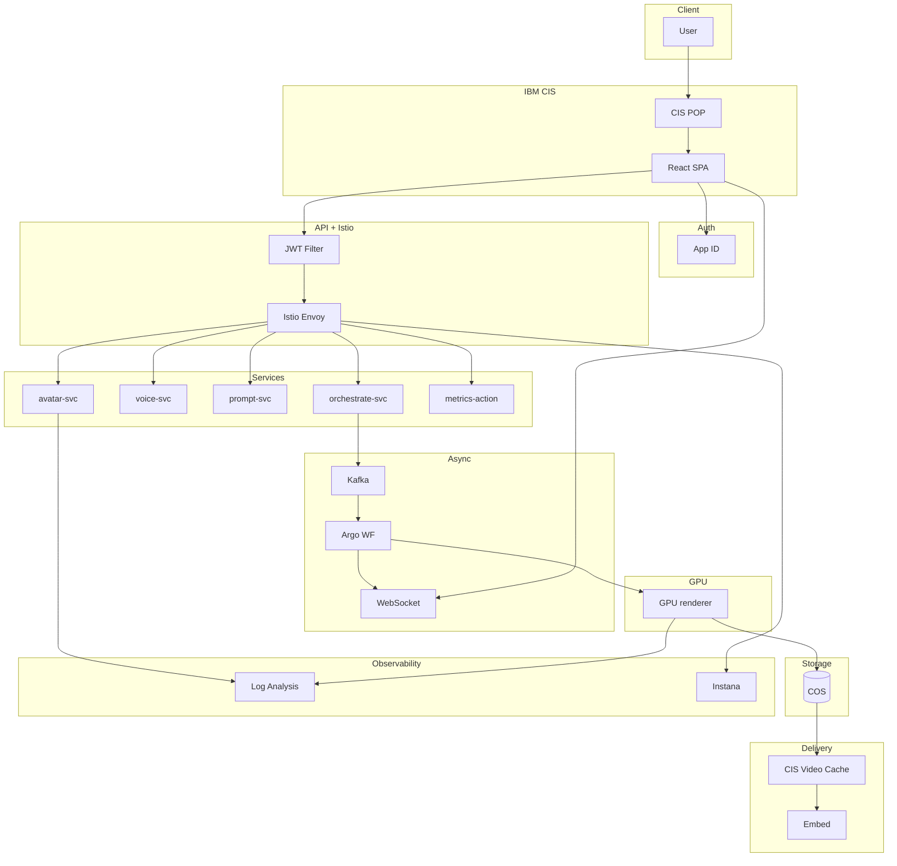

# 🛠️  VideoGenie – Local & Production Setup Guide

---

## Part A · Local Smoke Stack (≤ 10 min)

This section gets the **entire platform** running on your laptop with Docker + Kind.
Perfect for UI work, quick API iterations, or demo videos on a plane.

### 0 · Prerequisites

* Docker 24+
* [Kind v0.23](https://kind.sigs.k8s.io/)
* GNU Make 4.x
* Node 18 LTS
* Python 3.11
* Git 2.40+

### 1 · Clone & Tooling

```bash
git clone https://github.com/videogenie/watsonx-videogenie.git
cd watsonx-videogenie

make setup              # → .venv + pre‑commit
````

### 2 · Model Artifacts

```bash
make fetch-wav2lip       # clones repo + downloads wav2lip_gan.pth
make prepare-models      # mkdir models/ ; copy your PNGs in here
```

### 3 · Build Docker Images

```bash
make container-build TAG=$(git rev-parse --short HEAD)
```

### 4 · Kind Cluster

```bash
make kind-up                       # 1‑node K8s 1.30
make install-istio install-argo install-keda
```

### 5 · Deploy Helm Chart

```bash
helm upgrade --install videogenie charts/videogenie \
  --namespace videogenie --create-namespace \
  --set global.image.tag=$(git rev-parse --short HEAD)
```

### 6 · Run the SPA

```bash
cd frontend
npm ci
npm start          # http://localhost:5173
```

You’re live 🎉  —  hit **Generate** and watch WebSocket progress in real time.

### 7 · Clean‑up

```bash
make kind-down
```

---

## Part B · Production Deployment Kit – IBM Cloud

*19 July 2025 – commands copy‑paste verified.*

### 1 · Edge, Certs, Bucket

```bash
ibmcloud cis instance-create vg-cis standard eu-de
# In CIS UI → add zone videogenie.cloud → delegate NS at registrar.
# TLS tab → Issuer = Let's Encrypt, domains = *.videogenie.cloud
ibmcloud cos bucket-create --bucket spa-assets --class standard --region eu-de
```

*Enable Static Website on bucket, index = `index.html`.*

### 2 · App ID

```bash
ibmcloud resource service-instance-create vg-appid appid lite eu-de
```

Dashboard → Add Web App → copy **clientId** & discovery URL, set redirect
`https://app.videogenie.cloud/callback`.

### 3 · API + WS Gateways

*HTTP API* for REST, *WS API* for `/ws/notify`.
Add JWT plug‑in pointing at App ID JWKs.
Create CIS LB rules: `/api/*` → API host, `/ws/*` → WS host.

### 4 · Terraform Foundation

```bash
cd infra/terraform
terraform init
terraform apply -auto-approve -var domain="videogenie.cloud" -var region="eu-de"
```

Creates:

* CIS zone & DNS records
* COS buckets `spa-assets`, `videos-prod`
* Event Streams (Kafka) instance + topic `videoJob`
* Log Analysis, Secrets Manager, App ID outputs

Save the outputs for Helm values.

### 5 · OpenShift Cluster + GPUs

```bash
ibmcloud oc cluster create classic --name vg-cluster --zone eu-de-1 \
  --worker-pool cpu --flavor bx2.16x64 --workers 3
ibmcloud oc worker-pool create gpu --cluster vg-cluster \
  --flavor g2.8x64 --workers 2 --labels role=gpu=true
```

Label & taint nodes (if not pre‑labelled):

```bash
oc label nodes -l ibm-cloud.kubernetes.io/flavor=g2.8x64 role=gpu=true
oc adm taint nodes -l role=gpu=true dedicated=gpu:NoSchedule
```

### 6 · Istio Mesh

Install from OperatorHub → create `ServiceMeshControlPlane` with STRICT mTLS.
Ingress hostname looks like `*.<cluster-id>.containers.appdomain.cloud`.

### 7 · Build & Push Images

```bash
ibmcloud cr region-set eu-de && ibmcloud cr login
export TAG=$(git rev-parse --short HEAD)
make container-build TAG=$TAG
make container-push TAG=$TAG
```

### 8 · Install Add‑ons

```bash
make install-istio install-argo install-keda
```

### 9 · Helm Release

```bash
helm upgrade --install videogenie charts/videogenie \
  --namespace videogenie --create-namespace \
  --set global.image.tag=$TAG \
  --set spa.bucket=$(terraform -chdir=infra/terraform output -raw spa_bucket) \
  --set appid.clientId=$(terraform -chdir=infra/terraform output -raw appid_client_id) \
  --set kafka.brokers=$(terraform -chdir=infra/terraform output -raw kafka_brokers)
```

### 10 · GitHub → Tekton → Argo CD

* `.github/workflows/ci.yml` builds & pushes on commit.
* Tekton `build-and-deploy` pipeline bumps Helm values.
* Argo CD auto‑syncs `videogenie` release.
* Post‑deploy job purges CIS cache via:

```bash
ibmcloud cis cache-purge $(cis zone ls | awk '/videogenie/{print $1}') --all
```

### 11 · Observability

```bash
# Log Analysis agent
oc apply -f manifests/logdna-agent.yaml

# Instana
oc apply -f manifests/instana-agent.yaml
```

Dashboards “Job Latency” & “GPU Utilisation” appear automatically.

### 12 · Smoke Test

Open `https://app.videogenie.cloud`  → login via App ID → paste script → **Generate**.
Watch status WebSocket; MP4 URL appears ‑ verify playback is via `https://assets-public.videogenie.cloud/*`.

### 13 · Clean‑up

```bash
helm uninstall videogenie -n videogenie
terraform -chdir=infra/terraform destroy -auto-approve
ibmcloud cis instance-delete $(cis zone ls | awk '/videogenie/{print $1}') -f
```

## 14 · Mermaid Architecture (Reference)



---

*Enjoy building!*  PRs & issues welcome.
For support jump into `#videogenie` on the IBM Cloud community Slack.

